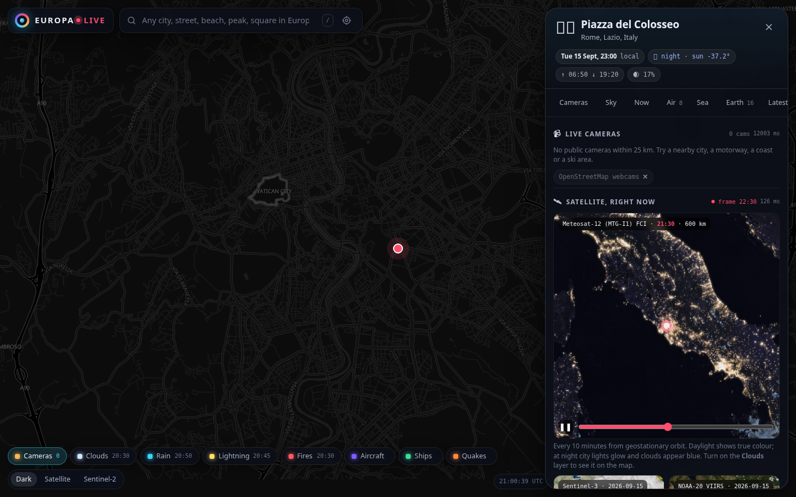
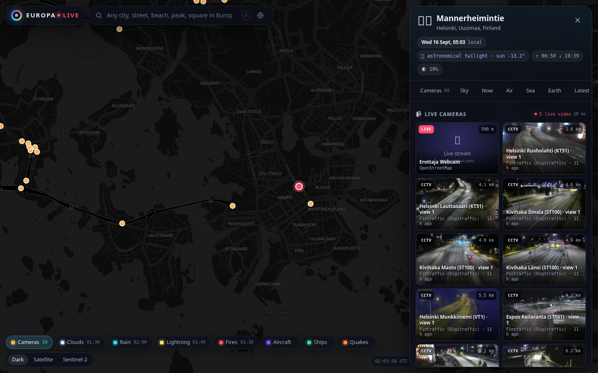
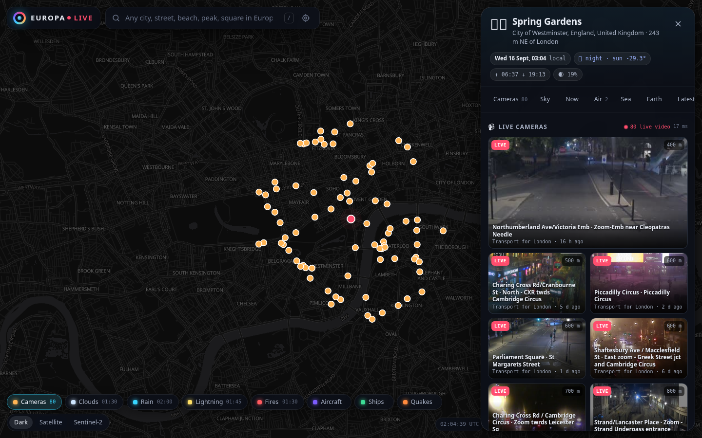

# Europa Live

**Click anywhere in Europe and see it right now.**

Europa Live is a map-first web app: click any point on the continent (or search any of 8,400 cities, streets, beaches or peaks) and within a second or two you get everything that can be *seen* or *sensed* there live:

| Tier | What you get | Cadence | Source |
|---|---|---|---|
| **Cameras** | Public webcams and traffic CCTV around the point, auto-refreshing, with live video where available | seconds to 10 min | 5,700 open national road cameras (Finland, London, Iceland, Spain, Estonia, A22 Brennero), webcams mapped in OpenStreetMap (SkylineWebcams, YouTube live and municipal streams), optional Windy / YouTube / Trafikverket |
| **Sky** | Meteosat GeoColour loop of the surrounding 600 km (true colour by day, city lights and blue clouds by night), thermal infrared, daily Sentinel-3 and VIIRS true-colour crops, rain radar frame | 10 min / daily | EUMETSAT, Copernicus, NASA GIBS, RainViewer |
| **Now** | Temperature, feel, wind and gusts, rain now, visibility, pressure, UV, European air quality index, sea temperature and waves at the coast, 24 h sparkline | 15 min | Open-Meteo, CAMS |
| **Air** | Aircraft overhead with callsign, type, altitude, speed, climb, distance and bearing, refreshed every 10 s | seconds | ADS-B community networks (adsb.fi, adsb.lol, optional OpenSky) |
| **Sea** | Vessels nearby with name, type, speed, destination | seconds | AIS via aisstream.io (key) |
| **Earth** | Official weather warnings for the exact region, GDACS disaster alerts, NASA EONET events, earthquakes of the last 30 days from three agencies, satellite fire detections | minutes | Meteoalarm, GDACS, EONET, EMSC / USGS / INGV, EFFIS / FIRMS |
| **Latest** | Newest geotagged photos (Commons, optional Mapillary street-level) and headlines mentioning the place | hours | Wikimedia, Google News |

On the map itself you can switch on live layers: **Clouds** (Meteosat, 10-minute frames with a time scrubber), **Rain** (radar, same scrubber), **Lightning** (Meteosat Lightning Imager), **Fires** (24 h VIIRS hotspots + 10-minute fire radiative power), **Aircraft** (moving, oriented icons), **Ships**, **Quakes** and **Cameras**, over a dark vector basemap or Esri / Sentinel-2 imagery.

Every panel section shows how fresh its data is and how long the fetch took. Deep links (`/#@41.8902,12.4922,12z`) reopen the same view.

## Screenshots

| Rome at night: Meteosat GeoColour loop, city lights | Helsinki: 80 live traffic cameras | London: TfL JamCams with live video |
|---|---|---|
|  |  |  |

## Run it

```bash
node scripts/build-data.js      # one-off: builds data/cities.json from GeoNames (already committed)
npm start                       # http://localhost:8080
```

No build step, **no runtime dependencies**: the server is Node 22 core only (http, fetch, zlib, crypto, cluster), the frontend is vanilla ES modules with a vendored MapLibre GL JS. Copy `.env.example` to `.env` (or export variables) for optional API keys; everything works without them.

```bash
docker build -t europa-live . && docker run -p 8080:8080 europa-live
```

## Architecture

```
browser ── SSE /api/live?lat&lon ──► app.js (router, security headers, rate limits)
                                        │
                                        ▼
                                providers/index.js  ── fan-out, completion-order streaming, per-provider deadline
                                        │
      ┌──────────┬──────────┬───────────┼───────────┬──────────┬──────────┐
    place     weather     cams      satellite     flights    quakes    alerts …   (12 providers)
                            │
                  cams/index.js ── runs every camera network covering the area concurrently,
                                   merges, de-duplicates, ranks by distance
                            │
              windy · osm · youtube · fi-digitraffic · gb-tfl · is-vegagerdin · es-dgt · ee-tarktee · it-a22 · se-trafikverket
```

* **Streaming, not waiting.** `/api/live` is a Server-Sent Events stream: each provider's result is pushed the moment it lands (weather and satellite in ~30 ms, cameras when the slowest network answers). `/api/live.json` returns the same as one document.
* **Instant place context.** Nearest city, timezone, local time, sun altitude, twilight phase, sunrise/sunset and moon phase come from the bundled GeoNames index and pure astronomy code before any network call. Nominatim enriches the name asynchronously.
* **Caching that respects the sources.** Coordinates are snapped to a 150 m grid so nearby clicks share cache entries; every upstream call goes through an LRU with stale-while-revalidate and in-flight coalescing; country-wide camera catalogues are cached for 30–60 min; the optional L2 store interface (`setStore`) accepts a Redis adapter for multi-node deployments.
* **Resilience.** Per-host concurrency limits, timeouts with jittered retries, and circuit breakers that skip a dead upstream for 30 s instead of waiting on it. Every camera network has its own deadline so one slow source never delays the rest.
* **Scale-out.** Stateless process; `WEB_CONCURRENCY=auto` forks one worker per CPU; static assets are pre-compressed (brotli + gzip) in memory with strong ETags; `/metrics` exposes Prometheus counters and latency histograms; `/healthz`, `/readyz` for orchestration; graceful shutdown on SIGTERM.

## Security

* Zero third-party runtime packages: nothing to audit in `node_modules`.
* Strict Content-Security-Policy (no inline scripts, allow-listed tile hosts, no framing), `X-Content-Type-Options`, `Referrer-Policy`, `Permissions-Policy`, COOP/CORP, HSTS when served over https.
* Input validation on every endpoint; coordinates outside Europe are rejected; only GET/HEAD are accepted.
* Sliding-window rate limits per client IP (separate budget for image bytes).
* The image proxy (`/img`, `/cam`) only fetches an explicit host allow-list derived from the camera sources, refuses credentials in URLs, follows redirects only to allow-listed hosts, caps bytes, sniffs content and relays image/video only. No user input ever forms an upstream hostname.
* Static files are read into memory at boot, so path traversal is impossible by construction.
* API keys stay on the server; `/api/status` only reports whether each key exists.

## API

| Endpoint | Purpose |
|---|---|
| `GET /api/live?lat&lon&r=25[&only=cams,weather]` | SSE stream of provider results (`meta`, one event per provider, `done`) |
| `GET /api/live.json?lat&lon` | Same as one JSON document |
| `GET /api/p/{provider}?lat&lon` | One provider (`place`, `weather`, `cams`, `satellite`, `radar`, `flights`, `ships`, `quakes`, `fires`, `alerts`, `photos`, `news`) |
| `GET /api/cams?lat&lon&r=` | Cameras around a point (map overlay) |
| `GET /api/flights?lat&lon&r=` · `/api/ships` | Live aircraft / vessels around a point |
| `GET /api/search?q=` | Places in Europe (local city index + OpenStreetMap/Photon) |
| `GET /api/layers` | Latest timestamps of the live map layers |
| `GET /api/place?lat&lon` | Instant local context |
| `GET /api/status` · `/healthz` · `/readyz` · `/metrics` | Operations |
| `GET /img?u=` · `/cam/{source}/{id}` | Allow-listed image proxy |

## Adding a camera network

Create an object in `server/providers/cams/countries.js` with `id`, `label`, `bbox`, `hosts`, `imageHosts` and a `list()` returning cameras in the common shape (`{ id, title, lat, lon, image, video?, embed?, page, updated?, live, source, kind, refreshSec, proxy? }`), then add it to `countrySources`. Networks whose frame URLs change per image implement `resolveImage(id)` and expose `image: '/cam/{source}/{id}'`.

## Data sources and attribution

Fintraffic / Digitraffic (CC BY 4.0), Transport for London, Vegagerðin, DGT, Transpordiamet, Autostrada del Brennero, OpenStreetMap contributors (ODbL), EUMETSAT, Copernicus (Sentinel-3, EFFIS, CAMS), NASA (GIBS, EONET, FIRMS), RainViewer, Open-Meteo (CC BY 4.0), adsb.fi and adsb.lol feeders, EMSC, USGS, INGV, Meteoalarm / EUMETNET, GDACS, Wikimedia Commons, GeoNames (CC BY 4.0), OpenFreeMap, Esri World Imagery, EOX Sentinel-2 cloudless. Please respect each provider's terms when deploying publicly.

## Development

```bash
npm run lint        # syntax-check every file
npm test            # 26 unit + integration tests (no network needed)
npm run smoke       # end-to-end against a running instance (needs network)
npm run screenshot  # headless-Chrome screenshots into screenshots/
```

MIT licensed.
